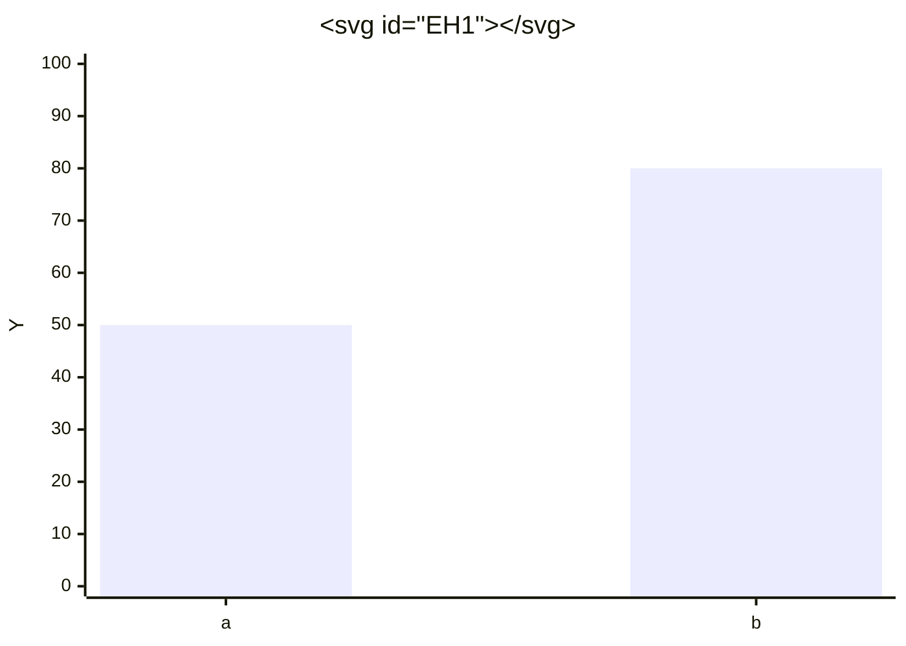
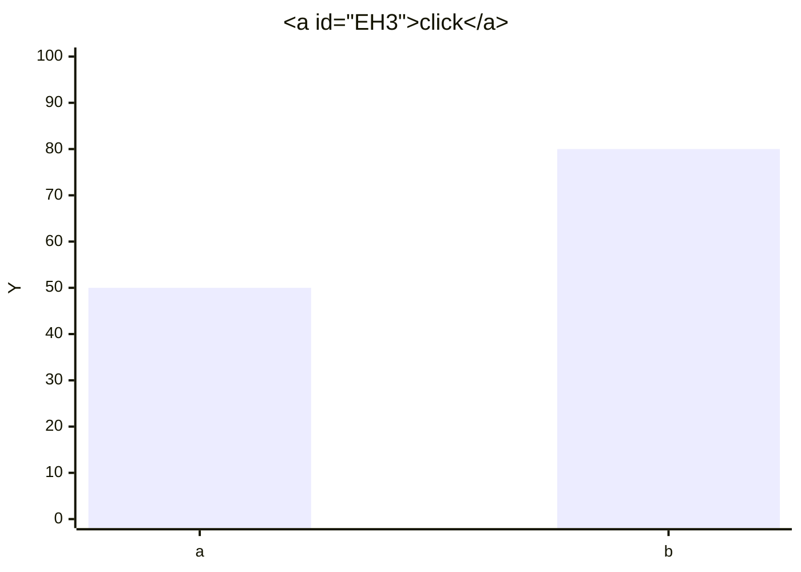
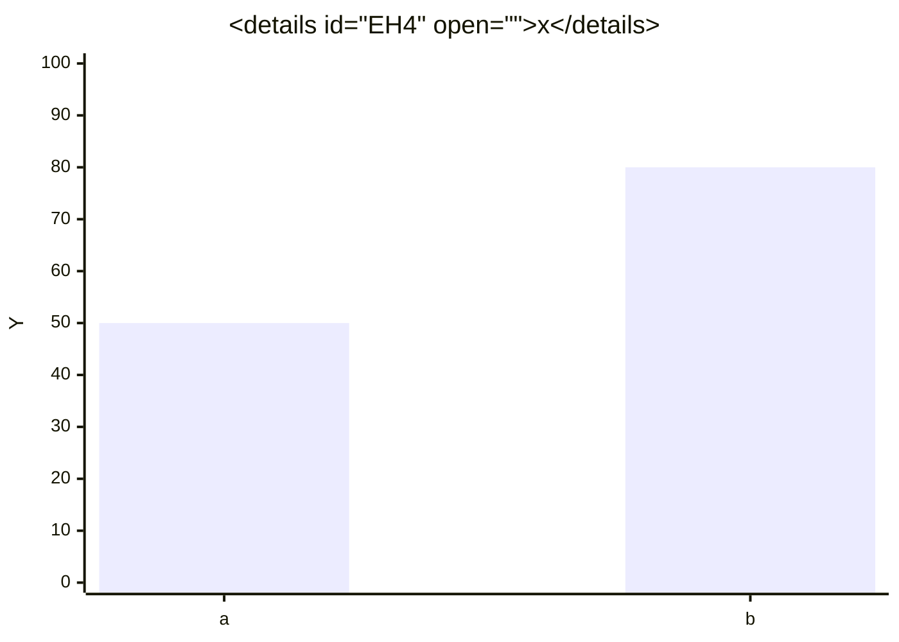
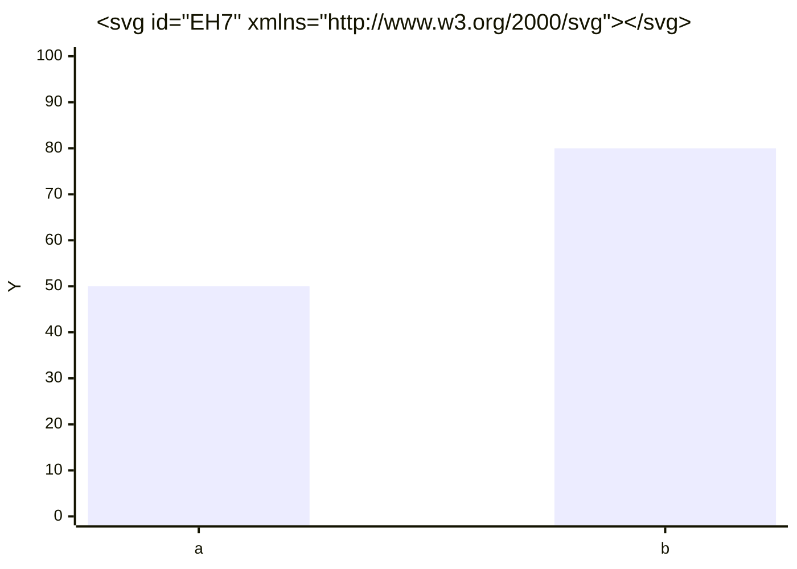
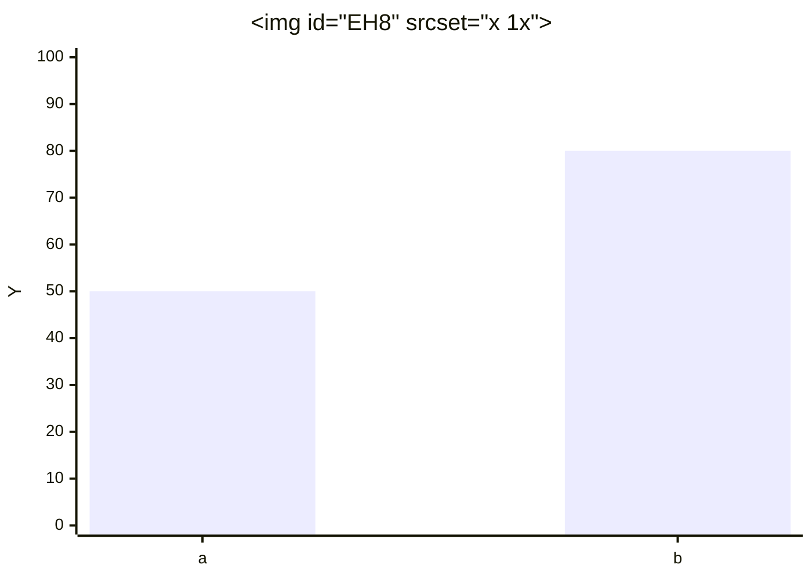
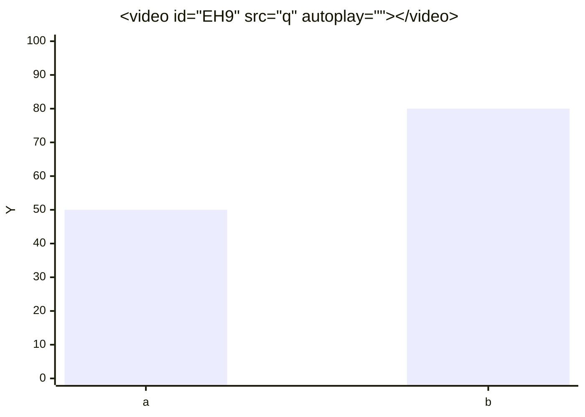
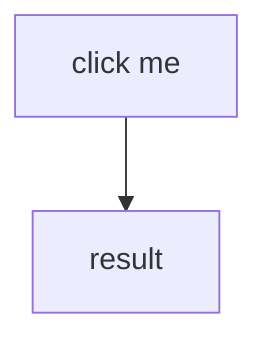
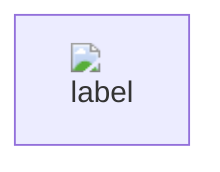

# Mermaid Event-Handler Escalation

## EH1: svg onload

## EH2: svg with animate onbegin

## EH3: a href javascript

## EH4: details ontoggle open

## EH5: input autofocus onfocus

```mermaid
xychart-beta
    title "<input id=EH5 autofocus onfocus='document.body.dataset.eh5=1'>"
    x-axis [a, b]
    y-axis "Y" 0 --> 100
    bar [50, 80]
```

## EH6: SVG with set/animate href to javascript

## EH7: SVG inline script via direct svg

## EH8: img with srcset and onerror

## EH9: video onloadstart

## EH10: Mermaid click directive (modern)

## EH11: Mermaid init securityLevel via metadata

## EH12: HTML inside flowchart node label (legacy htmlLabels)

